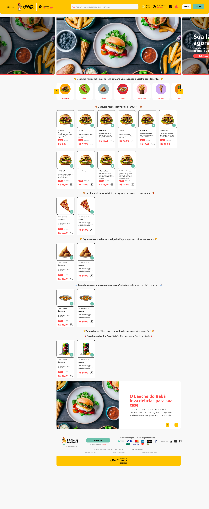

# GD Easy Delivery

## Descrição
O **GD Easy Delivery** é um sistema SaaS completo de pedidos online para empresas de food service.  
Permite gestão de pedidos, integração com WhatsApp e MercadoPago, além de painel administrativo e aplicativo mobile para clientes finais, garantindo eficiência operacional e escalabilidade.

---

## Tecnologias Utilizadas
- **Backend:** Node.js, JWT, Redis, WebSocket  
- **Frontend:** React, Redux, Material UI  
- **Mobile:** React Native / Flutter (dependendo do projeto)  
- **Banco de Dados:** MySQL, Prisma  
- **DevOps:** Docker, AWS, CI/CD  
- **Outros:** ElectronJS (versão desktop), Integração com impressão térmica  

---

## Funcionalidades Principais
- Cadastro e autenticação de usuários e restaurantes  
- Painel administrativo completo com controle de pedidos, relatórios e estatísticas  
- Aplicativo mobile para clientes finais, incluindo histórico de pedidos  
- Comunicação em tempo real via WebSocket para atualização de pedidos  
- Integração com WhatsApp para envio de notificações automáticas  
- Integração com MercadoPago para pagamentos online  
- Impressão térmica em tempo real para restaurantes  

---

## Prints / Demonstração
Exemplos visuais do projeto (substitua pelos seus prints):  

  
  
  

---

## Arquitetura (Resumo)
Fluxo simplificado do projeto:

## Explicação do fluxo:

O frontend e o app mobile se comunicam com a API Node.js, que gerencia pedidos, autenticação e lógica de negócios.

A API interage com o banco de dados MySQL e Redis para armazenamento e cache.

Serviços externos, como MercadoPago e WhatsApp, são usados para pagamentos e notificações em tempo real.

A versão desktop com ElectronJS permite impressão térmica imediata para restaurantes.

Todo o sistema é escalável e confiável, garantindo eficiência para restaurantes e experiência fluida para clientes.

## Observações

O código do projeto está em repositório privado e pode ser disponibilizado mediante solicitação.

Este README tem o objetivo de apresentar funcionalidades, tecnologias e fluxos do projeto sem expor código sensível.
